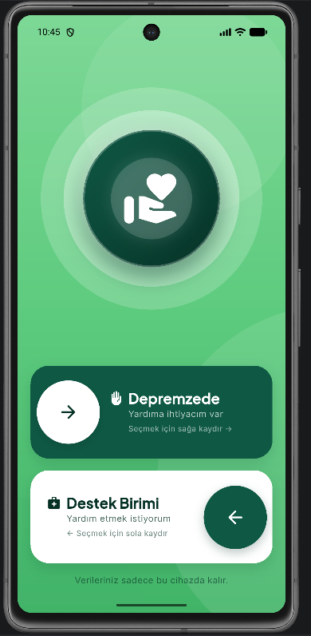
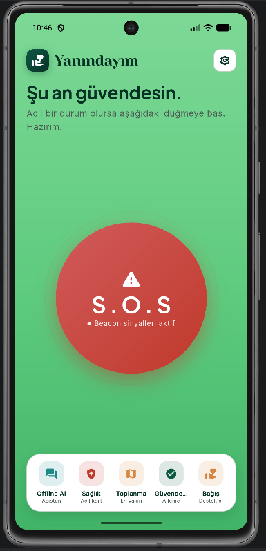
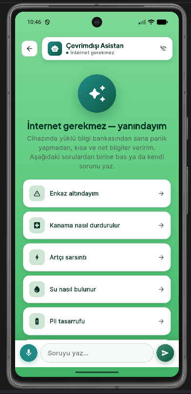
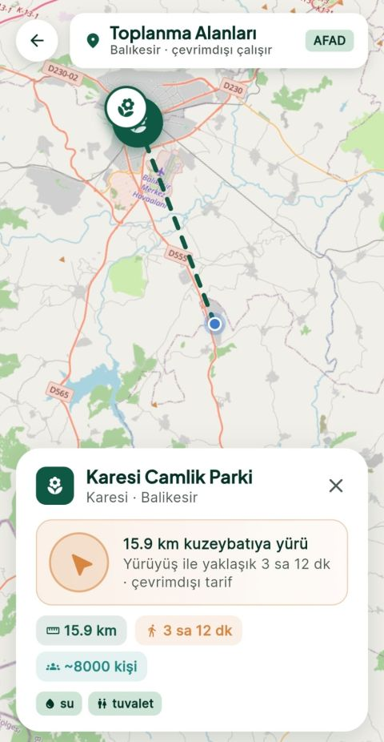
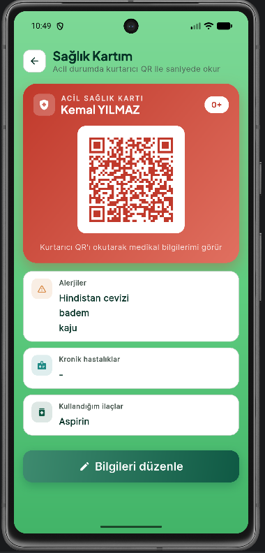
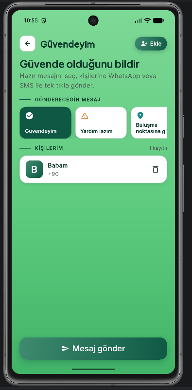
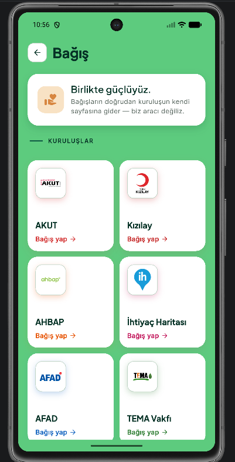
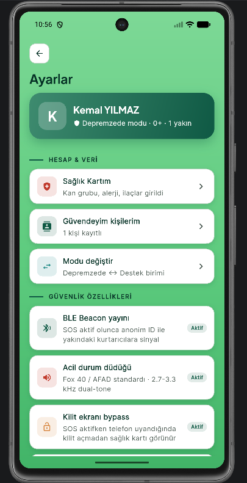
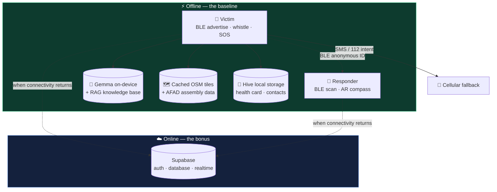

<div align="center">

# Yanındayım

### Disaster response that works when the network doesn't.

An offline-first mobile app for the first 72 hours after a major earthquake — when base stations are down and every minute counts.

[](https://flutter.dev)
[](https://ai.google.dev/gemma)
[](https://supabase.com)
[](https://www.bluetooth.com)
[](https://www.openstreetmap.org)

**Built in 40 hours** · EBST Hackathon 2026 · Balıkesir University

</div>

---

## The problem

After the February 2023 earthquakes in Türkiye, base stations collapsed across eleven provinces. Internet and cellular service went dark exactly when they mattered most.

Survivors trapped under rubble had working phones in their pockets. Rescue teams stood meters away. Neither could reach the other, because every tool they had assumed a connection that no longer existed.

**Yanındayım removes that assumption.** Every life-critical feature — distress signaling, first-aid guidance, navigation, medical records — runs on the device itself. No server. No signal. No internet.

---

## Two roles, one app

The very first screen splits the app into two vertical experiences: **Depremzede** (needs help) and **Destek Birimi** (provides help). Each role gets a purpose-built interface instead of a shared menu with buried options — under stress, fewer decisions is better. Role selection is a swipe gesture, not a tap, so it survives cracked screens and shaking hands.

The onboarding screen also states the app's privacy stance up front: *"Verileriniz sadece bu cihazda kalır"* — your data stays on this device.

<div align="center">

| Role selection | SOS + live beacon | On-device AI assistant |
|:---:|:---:|:---:|
|  |  |  |

| AFAD assembly areas | Emergency health card | Family check-in |
|:---:|:---:|:---:|
|  |  |  |

| Donation routing | Safety settings |
|:---:|:---:|
|  |  |

</div>

---

## Features

### 🔵 BLE peer-to-peer distress beacon

The core of the app. A trapped victim's phone advertises a Bluetooth Low Energy beacon carrying a compact distress payload under an **anonymous ID** — no name, no account, nothing that identifies the person to a stranger scanning the air. Any responder's phone within range picks it up and surfaces proximity and signal strength.

No internet. No base station. No pairing handshake. Two phones and a radio that draws almost no power.

- `flutter_ble_peripheral` — advertising on the victim side
- `flutter_blue_plus` — scanning on the responder side
- `ble_constants.dart` — shared payload protocol between the two
- `flutter_background_service` — keeps the beacon alive with the screen off, which matters when a phone has to last three days on one charge

### 📱 AR beacon scanning

Camera feed plus magnetometer compass (`camera` + `flutter_compass`). A responder points the phone at the rubble and sees the **bearing of nearby distress signals overlaid live** on the camera view. Signal strength narrows the distance; the compass gives the direction. Together they turn "somebody is within 30 meters" into "somebody is that way."

### 🤖 On-device LLM assistant (Gemma + RAG)

Gemma runs **locally on the phone** via `flutter_gemma` (MediaPipe), grounded by retrieval over a disaster-guidance knowledge base bundled into the app (`assets/knowledge_base/chunks.json`).

It answers the questions people actually ask in the first hours — *I'm under rubble. How do I stop bleeding. Aftershock safety. How to find water. How to save battery* — with the radio switched off entirely. Because generation is grounded in a vetted, fixed corpus rather than open-ended, the assistant cannot improvise dangerous medical advice.

Voice input via `speech_to_text` covers anyone who can speak but cannot reach or see their screen.

### 🚨 SOS with lock-screen bypass and cellular fallback

One button starts everything: beacon broadcasting, the audible whistle, and location capture.

`wakelock_plus` keeps the screen alive, and while SOS is active the **health card is visible without unlocking the phone** — so a responder who finds an unconscious person gets blood type and allergies immediately, without a PIN they will never have.

Where any cellular channel still survives, SMS and 112 intents fire in parallel via `url_launcher`. SMS frequently gets through in conditions that kill data connections, so it is treated as a first-class path rather than a fallback afterthought.

### 📢 Audible whistle beacon

Looping audio playback tuned to the **Fox 40 / AFAD standard: 2.7–3.3 kHz dual-tone**. That frequency band is chosen deliberately — it carries through concrete and debris better than a human voice, and it is the tone rescue teams are trained to listen for. For the last few meters, sound beats every radio.

### 📉 Stillness and impact detection

Accelerometer monitoring via `sensors_plus` for earthquake onset and prolonged immobility — the signal that someone has stopped moving and may need escalation.

### 🗺️ Offline maps and AFAD assembly points

`flutter_map` over locally cached OpenStreetMap tiles, layered with official AFAD assembly-area data. Selecting a site shows **walking distance, estimated time on foot, capacity, and on-site facilities** (water, sanitation) — with routing computed offline. In the screenshot: Karesi Çamlık Parkı, 15.9 km northwest, ~3 h 12 min on foot, capacity ~8,000.

### 🏥 QR emergency health card

Blood type, allergies, chronic conditions, and current medications rendered as a QR code via `qr_flutter`. A paramedic who has never met the patient scans it and has the medical picture in seconds — no internet, no records lookup, no conscious patient required.

### ✅ "I'm safe" family check-in

Pick contacts straight from the phonebook (`flutter_contacts`), choose a pre-written message — *Güvendeyim* / *Yardım lazım* / *Buluşma noktasına gidiyorum* — and send via WhatsApp or SMS in one tap. Pre-written matters: typing is the first thing that fails when hands shake.

### 🤝 Direct donation routing

Links straight to AKUT, Kızılay, AHBAP, İhtiyaç Haritası, AFAD, and TEMA. The app **never handles money and never sits between donor and organization** — every link goes to the institution's own page. A deliberate trust decision: disaster fundraising attracts fraud, and the safest architecture is one where we cannot touch the funds.

---

## Architecture



The principle throughout: **offline is the baseline, online is the bonus.** Supabase handles authentication, persistence, and realtime coordination when a connection exists — but nothing life-critical waits on it. Pull the SIM card and the app still signals, still advises, still navigates.

---

## Tech stack

| Layer | Package | Why this choice |
|---|---|---|
| Framework | Flutter / Dart | One codebase across Android and iOS |
| State & routing | `flutter_riverpod`, `go_router` | Predictable state across two distinct role flows |
| On-device LLM | `flutter_gemma` | Inference with zero network dependency |
| BLE advertise | `flutter_ble_peripheral` | Victim-side broadcasting |
| BLE scan | `flutter_blue_plus` | Responder-side detection |
| Background execution | `flutter_background_service`, `wakelock_plus` | Beacon survives screen-off; SOS survives lock |
| Mapping | `flutter_map`, `latlong2`, `geolocator` | Tiles cache locally; no proprietary SDK lock-in |
| AR direction finding | `camera`, `flutter_compass` | Bearing overlay on live camera |
| Sensors | `sensors_plus` | Impact and stillness detection |
| Audio | `audioplayers` | Looping whistle beacon |
| Voice | `speech_to_text` | Turkish hands-free input |
| Local storage | `hive`, `shared_preferences` | Health card and contacts persist on-device |
| Health card | `qr_flutter` | Offline-readable by any camera |
| Contacts | `flutter_contacts` | Check-in recipient selection |
| Backend (online only) | `supabase_flutter` | Auth, database, realtime sync |

---

## Project structure

```
lib/
├── core/
│   └── services/
│       ├── beacon_broadcast_service.dart   # BLE advertising — victim side
│       ├── beacon_scanner_service.dart     # BLE scanning — responder side
│       └── ble_constants.dart              # Shared payload protocol
└── features/
    ├── victim/
    │   ├── checkin/        # "I'm safe" family notification
    │   ├── health/         # QR emergency health card
    │   ├── map/            # Offline map + AFAD assembly areas
    │   ├── chat/           # On-device Gemma assistant
    │   └── pfa/            # Psychological first aid flow
    ├── rescuer/
    │   └── home/           # Beacon scanner and victim prioritization
    └── settings/           # Role switching, safety feature toggles

assets/
├── knowledge_base/         # RAG corpus (chunks.json)
├── maps/                   # Cached offline tiles
├── audio/                  # Whistle beacon
├── pfa_flow.json           # Psychological first aid decision tree
└── icon/                   # App icon source
```

Feature-first architecture: each role owns a vertical slice, shared infrastructure isolated in `core/`.

---

## Permissions and why each is needed

Emergency apps ask for a lot. Here is the honest accounting:

| Permission | Purpose |
|---|---|
| `BLUETOOTH_ADVERTISE` / `SCAN` / `CONNECT` | The peer-to-peer distress beacon — the app's core function |
| `ACCESS_FINE_LOCATION` + `BACKGROUND_LOCATION` | SMS payload coordinates and offline map positioning |
| `FOREGROUND_SERVICE` + `WAKE_LOCK` | Beacon and SOS survive screen-off and lock |
| `SEND_SMS` / `CALL_PHONE` | Cellular fallback path to 112 and family |
| `RECORD_AUDIO` | Voice commands and stopping the whistle hands-free |
| `READ_CONTACTS` | Selecting check-in recipients |
| `CAMERA` | AR beacon direction finding |
| `INTERNET` | **Model download only** — no runtime dependency |

---

## Getting started

```bash
git clone https://github.com/kemylmaz/yanindayim.git
cd yanindayim
flutter pub get
flutter run
```

**Notes for a full run:**

- The Gemma model file is not committed (size constraints). It is fetched on first launch or must be supplied separately.
- Supabase credentials are not committed. Supply your own project URL and anon key to enable online features.
- BLE advertising, AR compass, and sensor features require a **physical device** — emulators do not expose these radios.

---

## Status and roadmap

Built under hackathon conditions in 40 hours. Core flows are functional; below are the honest next steps.

- [ ] **Multi-hop BLE mesh** — relay distress signals across intermediate devices, extending effective range far beyond line of sight
- [ ] **Responder verification** via e-Devlet QR PDF certificates, to keep unverified actors out of the responder network
- [ ] **Battery-optimized background scanning** for genuine multi-day operation
- [ ] **AFAD / Kızılay dispatch integration** — a formal data path into official coordination systems
- [ ] **Expanded knowledge base** with a broader vetted disaster corpus
- [ ] **Other disaster types** — floods, wildfires, industrial accidents

---

## Design notes

A few decisions worth stating, because they were deliberate rather than accidental:

**Green, not red.** Emergency apps default to red alarm palettes. Red raises heart rate — the opposite of what someone under rubble needs. The interface is calm green; red appears only on the SOS button itself, where urgency is the point.

**Reassurance before instruction.** The home screen opens with *"Şu an güvendesin"* — you are safe right now — before showing any control. Panic degrades decision-making more than missing information does.

**Swipe to choose a role, not tap.** A larger gesture target for shaking hands and damaged screens.

**Pre-written messages.** Every outgoing communication is one tap on a prepared template. Nothing life-critical requires typing.

---

## Team

| | Role |
|---|---|
| **Kemal Yılmaz** — [@kemylmaz](https://github.com/kemylmaz) | Product concept, target audience, business model, pitch |
| **Serhat Yoldoruk** — [@SerhatYoldoruk](https://github.com/SerhatYoldoruk) | Development |
| **Emir Özel** — [@Emrzel](https://github.com/Emrzel) | Development |

---

## Türkçe

**Yanındayım**, büyük bir deprem sonrası ilk 72 saat için tasarlanmış, internet bağlantısı olmadan çalışan bir afet müdahale uygulamasıdır.

Şubat 2023 depremlerinde baz istasyonları on bir ilde çöktü ve tam da en çok ihtiyaç duyulan anda iletişim tamamen kesildi. Yanındayım bu varsayımı ortadan kaldırır: hayati her özellik cihazın kendisinde çalışır.

**Öne çıkan özellikler:**

- **BLE eşler arası yardım sinyali** — enkaz altındaki kişinin telefonu anonim bir ID ile Bluetooth sinyali yayınlar, yakındaki destek birimlerinin telefonları bunu internetsiz yakalar
- **AR beacon tarama** — kamera ve pusula ile sinyalin yönü canlı olarak ekranda gösterilir
- **Cihazda çalışan yapay zekâ** — Gemma modeli telefonda yerel olarak çalışır, uygulamaya gömülü afet bilgi tabanından cevap üretir; internet gerekmez, uydurma tıbbi tavsiye vermez
- **Kilit ekranı bypass** — SOS aktifken sağlık kartı telefon açılmadan görünür
- **Acil durum düdüğü** — Fox 40 / AFAD standardında 2.7–3.3 kHz çift tonlu ses
- **Çevrimdışı harita ve AFAD toplanma alanları** — yürüme mesafesi, süre, kapasite ve olanaklar dahil
- **QR kodlu acil sağlık kartı** — kan grubu, alerjiler, ilaçlar saniyeler içinde okunur
- **Güvendeyim bildirimi** — rehberden seçilen kişilere hazır mesajla tek tıkla haber verme
- **Bağış yönlendirme** — AKUT, Kızılay, AHBAP, İhtiyaç Haritası, AFAD ve TEMA'nın kendi sayfalarına doğrudan yönlendirme; uygulama para akışına hiçbir noktada dahil olmaz

Flutter ile, EBST Hackathon 2026 kapsamında 40 saatte geliştirildi.

---

<div align="center">

**Çünkü her saniye bir hayattır.**

</div>
